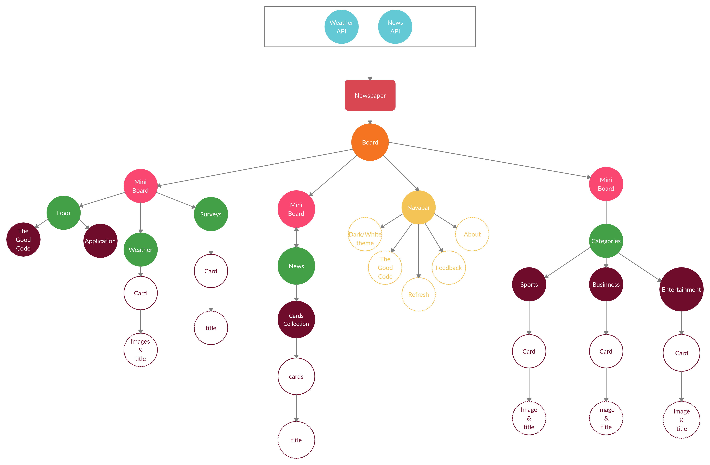

# Newspaper

Newspaper is a react-application that doesnt look like a typical newspaper. 

This application is divided into smaller and smaller components bcoz thats what we have to do in react. (Divide in components and each component should have single task. psst... not necessarily, but thats a good practise.)

    *this is the components flow chart of the application*

Next, I have to create a backend that fetches news from newsapi and weather from weathermap api. 

I will use MERN stack to build the application and google cloud platform to deploy the application.